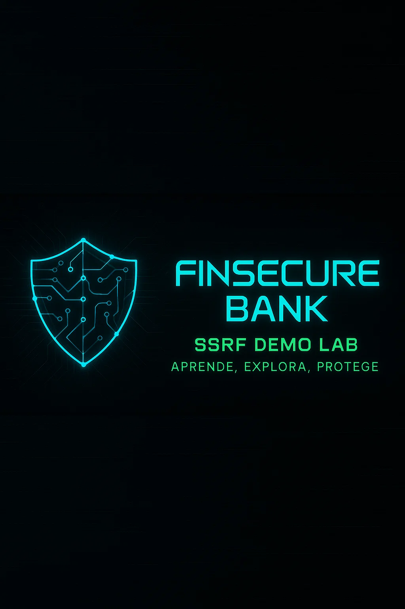

<p align="center">
  
</p>


<h1 align="center">SSRF Demo Lab</h1>
<p align="center">
  <strong>Laboratorio interactivo para comprender y explotar vulnerabilidades de <code>Server-Side Request Forgery (SSRF)</code></strong><br/>
  Simulación de una app bancaria moderna con una falla crítica en su arquitectura interna.
</p>

<p align="center">
  <a href="#%EF%B8%8F-características">⚙️ Características</a> • 
  <a href="#-requisitos">📦 Requisitos</a> • 
  <a href="#-ejecución">🚀 Ejecución</a> • 
  <a href="#-ataque-ssrf">🎯 Ataque SSRF</a> • 
  <a href="#-endpoints">📡 Endpoints</a> • 
  <a href="#-mitigación">🛡️ Mitigación</a> • 
  <a href="#-estructura-del-proyecto">🗂️ Estructura</a> • 
  <a href="#-explotación-automática">📄 Licencia</a>
</p>


## ⚙️ Características

> La aplicación imita un banco online con lógica realista y estética moderna. Pensada para demostrar cómo una mala validación de peticiones externas puede comprometer toda la infraestructura interna.

- ✅ Registro de usuarios mediante **DNI válido** (letra calculada con algoritmo real).
- ✅ Subida de PDF obligatoria durante el registro (valida que no esté vacío).
- ✅ Se generan **250.000 usuarios con saldos aleatorios** al arrancar el sistema.
- ✅ Dashboard de usuario con transferencias y formulario para mover fondos.
- ✅ Estética inspirada en fintech real, usando **TailwindCSS** vía CDN.
- ✅ Portada personalizada con SVGs, testimonios, ventajas y llamada a la acción.
- ✅ Pie de página con enlaces útiles y cabecera visual atractiva.
- ✅ Saldos formateados al estilo europeo: `1.234,56 €`.


## 📦 Requisitos

- Python 3.7 o superior
- Instalar dependencias con:
```bash
  pip install -r requirements.txt
```


## 🚀 Ejecución

Lanza el entorno completo con:

```bash
python run.py
```

Esto inicia:

| Servicio          | Puerto          | Descripción                        |
| -- |  | - |
| `app_internal.py` | `127.0.0.1:443` | Backend bancario interno           |
| `app_public.py`   | `0.0.0.0:80`  | Interfaz web accesible al atacante |

También puedes ejecutarlos por separado:

```bash
python app_internal.py
python app_public.py
```

Una vez iniciado, visita 👉 `http://localhost`


## 🎯 Ataque SSRF

1. Regístrate con un DNI válido (ej. `12345678Z`) y sube un PDF cualquiera.
2. Accede al *dashboard* y localiza la sección **"Verificar URL externa"**.
3. Introduce una URL interna como:

   ```
   http://127.0.0.1:443/transfer?from=ES111...&to=ES222...&amount=500
   ```
4. El servidor hará una petición interna sin validar y transferirá fondos desde la cuenta objetivo.
5. Vuelve al *dashboard* para ver tu nuevo saldo enriquecido 🤑.


## 📡 Endpoints

### 🌐 app\_public.py (puerto 5000)

| Ruta               | Descripción                                                     |
|  |  |
| `/`                | Portada informativa estilo fintech                              |
| `/register`        | Registro con validación de DNI y PDF                            |
| `/login`           | Login con DNI y contraseña                                      |
| `/dashboard`       | Vista de cuenta + formulario de transferencia                   |
| `/verify_external` | **Vulnerable SSRF**: realiza `requests.get(url)` sin validación |

### 🔒 app\_internal.py (puerto 443)

| Ruta            | Descripción                                                     |
|  |  |
| `/users`        | Muestra todos los usuarios y sus IBAN                           |
| `/founds`       | Devuelve saldos por usuario                                     |
| `/transfer`     | Transferencia entre IBANs vía GET                               |
| `/transfer_all` | Vuelca fondos de todos al IBAN especificado (solo para pruebas) |


## 🛡️ Mitigación

Este proyecto es vulnerable por diseño. Sin embargo, en una app real:

* ✅ **Validar URLs** antes de usarlas (`.startswith('https://trusted.com')`)
* ✅ Evitar peticiones del servidor hacia direcciones externas arbitrarias
* ✅ Usar listas blancas o proxies internos con reglas de salida
* ✅ Realizar estas verificaciones en el cliente siempre que sea posible
* ✅ Implementar firewalls a nivel de red para bloquear tráfico loopback


## 🗂️ Estructura del Proyecto

```
ssrf-demo/
├── app_internal.py       # API interna simulada
├── app_public.py         # Interfaz vulnerable expuesta
├── run.py                # Inicia ambos servidores
├── bank.db               # Base de datos SQLite
├── requirements.txt
├── static/               # Estilos, imágenes, etc.
├── templates/            # HTML con Jinja2
├── assets/
│   └── logo.png          # Logo del proyecto
├── exploit/
│   └── exploit.py        # Script de explotación (ver README dentro)
└── README.md
```


## 🧪 Explotación Automática

El script [`exploit/exploit.py`](exploit/exploit.py) automatiza el ataque SSRF. Consulta su [README específico](exploit/README.md) para más detalles y ejecución paso a paso.


## 📄 Licencia

Este proyecto es solo para uso **educativo**. No está diseñado para producción ni debe ser utilizado con fines maliciosos. [LICENCIA MIT](LICENSE.MD)


<p align="center">
  <strong>SSRF DEMO LAB — Aprende. Rompe. Protege.</strong>
</p>
